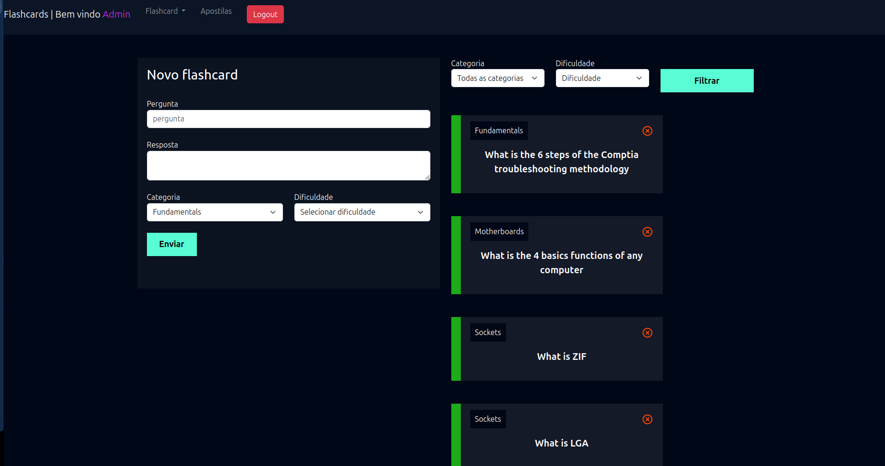
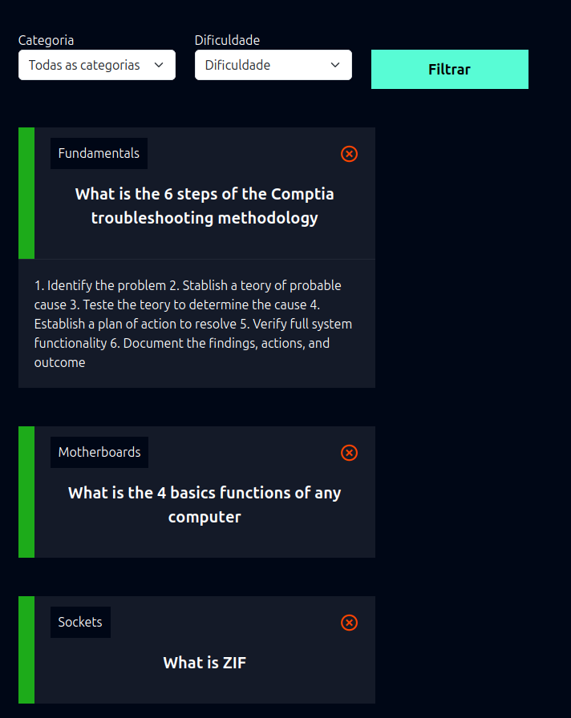
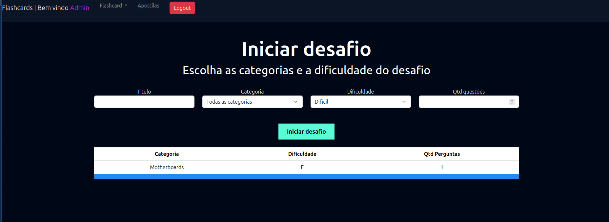
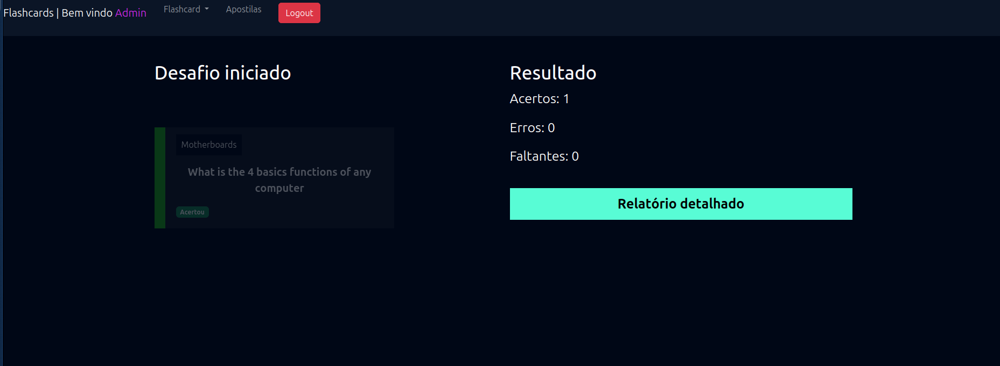

                                                
# Django Flashcards App


**Flashcards App** is a dynamic and user-friendly Django-based application designed to enhance your study sessions. This app allows you to create, manage, and interact with flashcards, track your progress, and visualize additional study materials.



## Features

- **User Authentication:**
  - Secure login and registration system.
  - User-specific data management for a personalized experience.

- **Flashcards Management:**
  - Create and organize flashcards by categories.
  - Edit, delete, or view your flashcards with ease.

- **Challenge Mode:**
  - Test your knowledge with challenges.
  - Track progress based on correct and incorrect answers.

- **PDF Viewer:**
  - Upload and view PDF study materials directly in the app.

- **Progress Tracking:**
  - Monitor your performance and improve with detailed analytics.

## Installation

Follow these steps to set up the project locally:

### Prerequisites
- Python 3.8 or higher
- Django 4.0 or higher
- pip

### Steps

1. **Clone the repository:**
   ```bash
   git clone https://github.com/your-username/flashcards-app.git
   cd flashcards-app
   ```

2. **Create a virtual environment:**
   ```bash
   python -m venv venv
   source venv/bin/activate  # On Windows: venv\Scripts\activate
   ```

3. **Install dependencies:**
   ```bash
   pip install -r requirements.txt
   ```

4. **Run migrations:**
   ```bash
   python manage.py makemigrations
   python manage.py migrate
   ```

5. **Create a superuser:**
   ```bash
   python manage.py createsuperuser
   ```

6. **Start the development server:**
   ```bash
   python manage.py runserver
   ```

7. **Access the app:**
   Open your browser and navigate to `http://127.0.0.1:8000/`.

## Usage

1. Register or log in to your account.
2. Create flashcards by specifying categories and content.
3. Engage with your flashcards through challenge mode.
4. Upload and view additional study materials in PDF format.
5. Track your progress to identify strengths and areas for improvement.

## Project Structure

```
flashcards-app/
├── flashcards/         # Main app for managing flashcards
├── accounts/           # User authentication system
├── static/             # Static files (CSS, JS, Images)
├── templates/          # HTML templates
├── media/              # Uploaded files (PDFs)
├── manage.py           # Django's management script
└── requirements.txt    # Python dependencies
```

## Contributing

Contributions are welcome! Follow these steps to contribute:

1. Fork the repository.
2. Create a new branch: `git checkout -b feature/your-feature`.
3. Commit your changes: `git commit -m 'Add a feature'`.
4. Push to the branch: `git push origin feature/your-feature`.
5. Submit a pull request.

## License

This project is licensed under the MIT License. See the [LICENSE](LICENSE) file for details.

## Acknowledgements

- Django for the web framework.
- PDF.js for the PDF viewer integration.

## Contact

For any questions or suggestions, feel free to open an issue or reach out via email at `your-email@example.com`.

---

Leave a star ⭐ on the repository if you find it useful!




